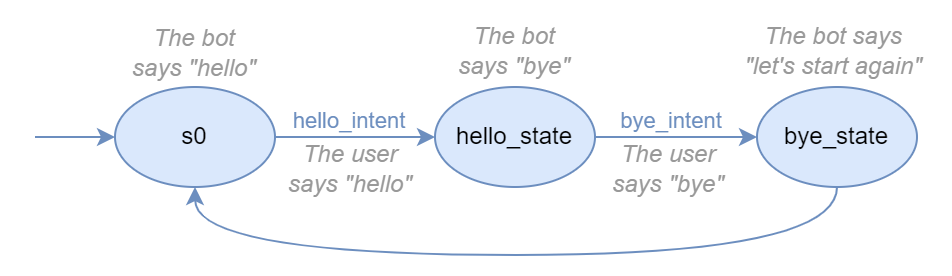

Core
====

The core package defines and implements the basic components of a chatbot architecture. BBF relies on
`State Machines <https://en.wikipedia.org/wiki/Finite-state_machine>`_ to define the bot execution logic.

   Example diagram of the :doc:`Greetings bot <../examples/greetings_bot>` state machine

Table of contents
-----------------

.. toctree::
   :maxdepth: 1

   core/states
   core/intents
   core/entities
   core/transitions
   core/sessions
   core/files
