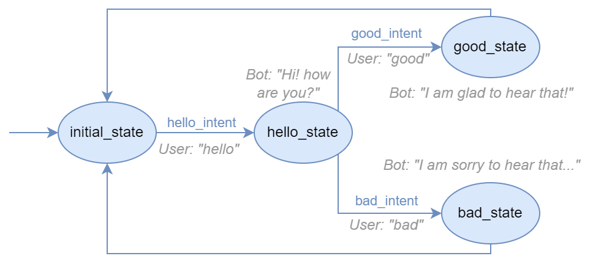

Core
====

The core package defines and implements the basic components of an agent architecture. BAF relies on
`State Machines <https://en.wikipedia.org/wiki/Finite-state_machine>`_ to define the agent execution logic.

   Example diagram of the :doc:`Greetings agent <../examples/greetings_agent>` state machine

Table of contents
-----------------

.. toctree::
   :maxdepth: 1

   core/states
   core/intents
   core/entities
   core/sessions
   core/events
   core/transitions
   core/gui
   core/processors
   core/files
