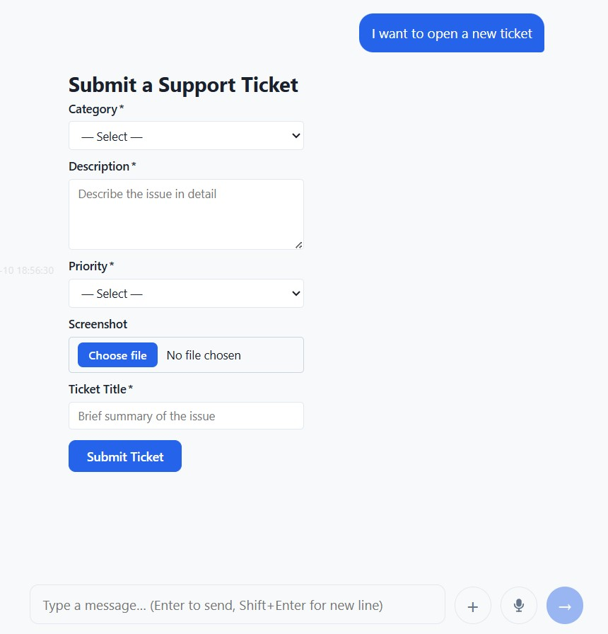

GUI replies
===========

A GUI reply is a GUI component the agent sends as a message in the conversation. The
client receives it and renders it inline, just like a text message — but instead of
plain text, the user sees a form, a chart, a data table, or any other BESSER BUML
view element.

This is useful when the conversation reaches a point where structured input or a rich
visual is the best way to interact with the user.

   A form rendered inline as a GUI reply inside the chat conversation.

AgentGUI
--------

The :class:`~baf.core.gui.agent_gui.AgentGUI` class is BAF's wrapper around a BESSER
BUML ``GUIModel``. It adds a few extra attributes that control how the GUI behaves when
sent as a reply.

.. code:: python

   from baf.core.gui.agent_gui import AgentGUI

   agent_gui = AgentGUI(
       model,            # a besser GUIModel instance
       gui_id='my_form', # optional; auto-generated UUID if omitted
       persist=True,     # track input changes in the session (see below)
       width='480px',    # optional CSS width for the chat bubble
   )

The key attributes of :class:`~baf.core.gui.agent_gui.AgentGUI` are:

- **model** — the underlying ``GUIModel`` built with the BESSER BUML library.
- **id** — a unique string identifier for this GUI component. Used to distinguish
  between multiple GUI replies in the same session, and to match form submissions
  to the right ``AgentGUI``.
- **persist** — when ``True``, input changes and form submissions are automatically
  tracked in :any:`session.gui_inputs <Session.gui_inputs>` (see `Persisting form inputs`_ below).
- **width** — a CSS width value (e.g. ``'480px'``, ``'60%'``) that overrides the
  default chat bubble width. Use wider values for multi-column layouts or charts,
  and narrower ones for simple forms.

Sending a GUI reply
-------------------

Use :meth:`~baf.platforms.websocket.websocket_platform.WebSocketPlatform.reply_gui`
from a state body to send a GUI to the user:

.. code:: python

   def show_form_body(session: Session):
       websocket_platform.reply_gui(session, registration_gui)

The GUI model is serialised to JSON and sent to the client, which renders it in the
chat thread. From that moment, any interaction with the GUI elements (typing in a
field, clicking a checkbox, submitting a form) generates :class:`~baf.library.transition.events.base_events.GUIEvent`
events that are dispatched back to the agent.

Building a GUIModel
-------------------

``GUIModel`` objects are built with the BESSER BUML library. Below is a minimal
example that creates a two-field registration form:

.. code:: python

    from besser.BUML.metamodel.gui import (
        GUIModel, Module, Screen,
        Form, InputField, InputFieldType,
    )
    from baf.core.gui.agent_gui import AgentGUI

    # Define the form fields
    name_field = InputField(
        name="full_name",
        description='Text input field',
        field_type=InputFieldType.Text,
        label="Full Name",
        required=True,
    )
    email_field = InputField(
        name="email",
        description='Email input field',
        field_type=InputFieldType.Email,
        label="Email",
        required=True,
    )

    # Group them in a Form component
    form = Form(
        name="registration_form",
        description='Form for registration',
        fields=[name_field, email_field],
        inputFields={name_field, email_field},
        submit_label="Register",
    )

    # Assemble the screen and model
    screen = Screen(name="home", view_elements={form}, is_main_page=True, description='Home')
    module = Module(name="main", screens={screen})
    gui_model = GUIModel(
        name="RegistrationUI",
        description='aaa',
        package="",
        versionCode="1.0",
        versionName="1.0",
        modules={module},
    )

    # Wrap in AgentGUI
    registration_gui = AgentGUI(gui_model, gui_id="registration_form", persist=True)

.. note::

   The BESSER BUML library supports a wide range of view elements: text, buttons,
   images, links, charts, tables, metric cards, and many input field types (text,
   dropdown, checkbox group, rating, slider, date range, and more).
   Refer to the `BESSER documentation <https://besser.readthedocs.io/en/latest/buml_language/model_types/gui.html>`_ for the full reference.

.. _gui-reply-persist:

Persisting form inputs
----------------------

When ``persist=True`` is set on an :class:`~baf.core.gui.agent_gui.AgentGUI`, BAF
automatically keeps track of every input change and form submission for that GUI in
``session.gui_inputs``.

``session.gui_inputs`` is a dictionary keyed by GUI id. Each entry is itself a
dictionary of ``{field_name: value}`` pairs that reflect the latest known state of
every form field:

.. code:: python

   # After the user has interacted with the form, gui_inputs holds the latest values
   def process_registration_body(session: Session):
       data = session.gui_inputs.get('registration_form', {})
       name  = data.get('full_name', '')
       email = data.get('email', '')
       session.reply(f'Thanks, {name}! We will reach out at {email}.')

The dictionary is updated in two ways:

- **On field change** (``onChange`` events): the individual field's value is updated.
- **On form submission** (``onSubmit`` events): all field values from the submission
  are merged in at once.

.. note::

   ``session.gui_inputs`` is only populated for GUI replies that have ``persist=True``.
   If ``persist=False`` (the default), input events are still dispatched to the agent
   as regular :class:`~baf.library.transition.events.base_events.GUIEvent` objects,
   but their values are not automatically stored.

Reacting to GUI events
----------------------

Every interaction with a GUI component — changing a field, clicking a button,
submitting a form — generates a :class:`~baf.library.transition.events.base_events.GUIEvent`
that the agent receives.

You can react to any GUI event using a generic ``when_event`` transition:

.. code:: python

   from baf.library.transition.events.base_events import GUIEvent

   state1.when_event(GUIEvent()).go_to(state2)

For **form submissions specifically**, BAF provides the dedicated
:meth:`~baf.core.state.State.when_form_submitted` transition. It uses a
:class:`~baf.library.transition.conditions.FormSubmitMatcher` condition and is
triggered only when an ``onSubmit`` event is received. Optionally, you can restrict
it to submissions from a specific form by passing the GUI's id:

.. code:: python

   # Triggered by any form submission
   state1.when_form_submitted().go_to(process_state)

   # Triggered only when registration_gui is submitted
   state1.when_form_submitted(form_id=registration_gui.id).go_to(process_state)

See :doc:`../transitions` for a full description of ``when_form_submitted`` and
the other available transitions.

Controlling the bubble width
----------------------------

By default, GUI replies are displayed at the same width as regular chat messages (up
to 78 % of the chat area). For wider layouts — two-column forms, charts, tables — set
the ``width`` attribute on the :class:`~baf.core.gui.agent_gui.AgentGUI`:

.. code:: python

   # Fixed pixel width
   wide_gui = AgentGUI(model, width='720px')

   # Percentage of the chat area width
   half_gui  = AgentGUI(model, width='50%')

The width can be any valid CSS length value. The chat bubble expands to the given
size, and the GUI content fills it. If no width is set, the bubble follows the
standard chat message sizing rules.

Full example
------------

Putting it all together: an agent that shows a registration form, waits for the user
to submit it, and then confirms the submission.

.. code:: python

   from baf.core.agent import Agent
   from baf.core.gui.agent_gui import AgentGUI
   from baf.core.session import Session

   agent = Agent('registration_agent')
   websocket_platform = agent.use_websocket_platform(use_ui=True)

   show_form_state    = agent.new_state('show_form',    initial=True)
   process_form_state = agent.new_state('process_form')
   done_state         = agent.new_state('done')

   # Build and wrap the GUI (see "Building a GUIModel" above)
   registration_gui = AgentGUI(model, gui_id='reg_form', persist=True, width='480px')

   def show_form_body(session: Session):
       session.reply('Please fill in the registration form below:')
       websocket_platform.reply_gui(session, registration_gui)

   show_form_state.set_body(show_form_body)
   show_form_state.when_form_submitted(form_id='reg_form').go_to(process_form_state)

   def process_form_body(session: Session):
       data  = session.gui_inputs.get('reg_form', {})
       name  = data.get('full_name', '(unknown)')
       email = data.get('email', '(unknown)')
       session.reply(f'Registration received! Name: {name}, Email: {email}.')

   process_form_state.set_body(process_form_body)
   process_form_state.go_to(done_state)

   def done_body(session: Session):
       session.reply('All done!')

   done_state.set_body(done_body)

   if __name__ == '__main__':
       agent.run()

Generating a GUI reply with an LLM
-----------------------------------

Instead of constructing a ``GUIModel`` manually, you can describe the desired GUI in
plain text and let an LLM build it for you.
:func:`~baf.core.gui.gui_llm.create_gui_with_llm` instructs the LLM to produce a JSON
object conforming to the AgentGUI schema, then deserializes it into a ready-to-send
:class:`~baf.core.gui.agent_gui.AgentGUI`. If the first response is invalid, the error
is fed back to the LLM and the call is retried up to ``max_retries`` times (default
``2``). On final failure it logs an error and returns ``None``.

.. code:: python

   from baf.core.gui.gui_llm import create_gui_with_llm

   def answer_body(session: Session):
       gui = create_gui_with_llm(
           llm=gpt,
           prompt=session.event.message,
       )
       if gui is not None:
           websocket_platform.reply_gui(session, gui)
       else:
           session.reply("Sorry, I could not generate that UI.")

Pass ``gui_id`` to assign a stable identifier (useful for form-submission matching) and
``max_retries`` to control how many correction attempts are made:

.. code:: python

   gui = create_gui_with_llm(
       llm=gpt,
       prompt="A registration form with name, email and a Submit button.",
       gui_id="reg_form",
       max_retries=3,
   )

API References
--------------

- AgentGUI: :class:`baf.core.gui.agent_gui.AgentGUI`
- create_gui_with_llm(): :func:`baf.core.gui.gui_llm.create_gui_with_llm`
- AgentGUI.id: :attr:`baf.core.gui.agent_gui.AgentGUI.id`
- AgentGUI.persist: :attr:`baf.core.gui.agent_gui.AgentGUI.persist`
- AgentGUI.width: :attr:`baf.core.gui.agent_gui.AgentGUI.width`
- GUIEvent: :class:`baf.library.transition.events.base_events.GUIEvent`
- Session: :class:`baf.core.session.Session`
- Session.gui_inputs: :attr:`baf.core.session.Session.gui_inputs`
- State.when_event(): :meth:`baf.core.state.State.when_event`
- State.when_form_submitted(): :meth:`baf.core.state.State.when_form_submitted`
- WebSocketPlatform.reply_gui(): :meth:`baf.platforms.websocket.websocket_platform.WebSocketPlatform.reply_gui`
