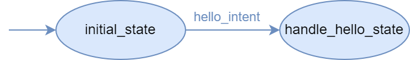

Intents
=======

Intents define the *intentions* or *goals* the user can express to a bot. In this article we review how to create
intents with the Bot Framework.

Simple intents
--------------

First of all, we need to create a bot and some states:

.. code:: python

    bot = Bot('example_bot')
    ...
    initial_state = bot.new_state('initial_state')
    handle_hello_state = bot.new_state('handle_hello_state')

Let's say we want to say hello to the bot. For that, we need an intent that defines how do "hello" messages look like.
To do that, we create an intent writing some **training sentences** as example messages we expect the bot to understand
in a "hello" message:

.. code:: python

    hello_intent = bot.new_intent('hello_intent', [
        'hello',
        'hi'
    ])

Once we have defined our intent, we need to add the proper :doc:`transitions <transitions>` to explicitly define where
this intent is expected to be received and where is the user expected to move once the intent is received:

.. code:: python

    initial_state.when_intent_matched_go_to(hello_intent, handle_hello_state)

When the user is in initial_state, the bot is waiting for a user message. Once the user sends a message, the bot will
classify it into one of the possible incoming intents in initial_state (here, only hello_intent can be recognized). If
the message's intent is hello_intent, the user will move to handle_hello_state, as we have defined it.

   The bot we just created, has 2 states linked by an intent.

.. _intents-with-parameters:

Intents with parameters
-----------------------

Intents can have embedded :class:`parameters <besser.bot.core.intent.intent_parameter.IntentParameter>`. This means that
we can extract data from a user message. At the same time, this can help reducing the number of intents in a bot.

We are going to create an intent to ask about the weather in a city.

.. code:: python

    weather_intent = bot.new_intent('weather_intent', [
        'what is the weather in CITY?',
        'tell me the weather in CITY',
        'weather in CITY'
    ])

As you can guess, the *CITY* fragment of the training sentences is going to host a parameter where the user can say any
city. Defining the intent parameter is really simple:

.. code:: python

    weather_intent.parameter('city1', 'CITY', city_entity)

Intent parameters have a **name**, a **fragment** that indicates the position of the parameter in the intent's training
sentences and an **entity** that defines the values that can be matched in the parameter.

See the :doc:`entities <entities>` guide to learn about them.

.. note::

    You can also add a list of parameters directly in the intent creation:

    .. code:: python

        weather_intent = bot.new_intent('weather_intent', training_sentences, parameters)

Then, we can create a transition that is triggered when the user intent matches weather_intent:

.. code:: python

    initial_state.when_intent_matched_go_to(weather_intent, handle_weather_state)

Reading the intent prediction results
-------------------------------------

Within a :any:`state-body` we can access the latest predicted intent from the user :doc:`session <sessions>`. Let's see it with an example body function.

(here we specify the type of each object, although it is not necessary to do it)

.. code:: python

    def handle_weather_body(session: Session):
        prediction: IntentClassifierPrediction = session.predicted_intent
        # We can get the intent object:
        intent: Intent = prediction.intent
        # We can get the score assigned to this intent by the intent classifier:
        score: float = prediction.score
        # We can get the message sent by the user:
        matched_sentence: str = prediction.matched_sentence
        # We can get the list of all matched parameters:
        matched_parameters: list[MatchedParameter] = prediction.matched_parameters
        # We can get a specific parameter by its name:
        city = prediction.get_parameter('city1')

        if city.value is None: # Sometimes the intent can be recognized, but not the parameters
            session.reply("Sorry, I didn't get the city")
        else:
            # Here we would call some API to get the temperature of the city
            temperature = some_service.get_temperature(city)
            session.reply(f"The weather in {city.value} is {temperature}°C")
            if temperature < 15:
                session.reply('🥶')
            else:
                session.reply('🥵')

API References
--------------

- Bot: :class:`besser.bot.core.bot.Bot`
- Bot.new_state(): :meth:`besser.bot.core.bot.Bot.new_state`
- Bot.new_intent(): :meth:`besser.bot.core.bot.Bot.new_intent`
- Intent: :class:`besser.bot.core.intent.intent.Intent`
- Intent.parameter(): :meth:`besser.bot.core.intent.intent.Intent.parameter`
- IntentClassifierPrediction: :class:`besser.bot.nlp.intent_classifier.intent_classifier_prediction.IntentClassifierPrediction`
- IntentParameter: :class:`besser.bot.core.intent.intent_parameter.IntentParameter`
- MatchedParameter: :class:`besser.bot.nlp.ner.matched_parameter.MatchedParameter`
- State: :class:`besser.bot.core.state.State`
- State.when_intent_matched_go_to(): :meth:`besser.bot.core.state.State.when_intent_matched_go_to`
- Session: :class:`besser.bot.core.session.Session`
- Session.reply(): :meth:`besser.bot.core.session.Session.reply`
