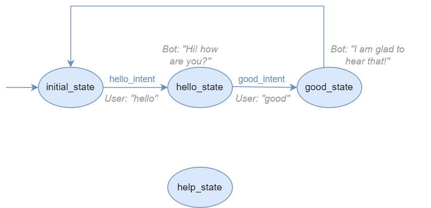

States
======

An agent is composed by a set of states. The user can navigate through the agent states by triggering the
transitions that move the user's current state in the agent to another one. Creating a new state
is really simple:

.. code:: python

    agent = Agent('example_agent')
    ...
    example_state = agent.new_state('example_state')

The agent must have 1 (and only 1) initial state, which is the starting point of the agent. To create an initial state,
simply set the following attribute:

.. code:: python

    initial_state = agent.new_state('initial_state', initial=True)

.. _state-body:

State body
----------

Agent states have a Python function attached, called *body*, which is executed when the user moves to them. Let's see an
example body:

.. code:: python

    def example_body(session: Session):
        session.reply('Hi! How are you?')

This body simply sends a message to the user. As you can guess, you can do anything within a body function, but always
be careful to avoid errors.

.. note::

    All exceptions produced in body functions are properly handled by the agent, so it will not crash the agent application.
    Nevertheless, we always recommend to be cautious and test your agents.

.. note::

    You can create states with no body function. These states will then have an empty body function that does nothing.

.. note::

    The initial state's body function is automatically run when a user establishes connection with the agent.

The body function must have 1 (and only 1) parameter: the user :doc:`session <sessions>`. There, the agent will read/write
user-related data (i.e private data). If your agent needs to read/write global or shared data among all users, you can
define any variable outside the body and use it inside.

Now, we must assign this body function to our state:

.. code:: python

    example_state.set_body(example_body)

.. _state-fallback-body:

State fallback body
-------------------

States have another body function that is intended to be run whenever the state fails when transitioning to another
state. A typical scenario is when the user sends a message to the agent, but the agent does not recognize the user intent,
ant therefore, runs the fallback body of the user's current state. The process is the same as with regular body
functions:

.. code:: python

    def example_fallback_body(session: Session):
        session.reply(session, "Sorry, I didn't understand you")

    example_state.set_fallback_body(example_fallback_body)

.. note::

    By default, all states have a fallback body that simply replies to the user "Sorry, I didn't get it"

There is a way to assign a custom fallback body to all agent states at the same time (replacing all previously assigned
fallback bodies). You need to do it through the agent object:

.. code:: python

    agent.set_global_fallback_body(example_fallback_body)

Note that if you create a state after that, it will not have your global fallback assigned.

State transitions
-----------------

See the :doc:`transitions <transitions>` guide to learn about the different kinds of transitions and how to define them.

Global States
-------------

Global States are a special kind of states.

As opposed to normal states, which are only accessible during certain parts of the agent conversation, global-states are accessible from anywhere.
In that sense, we could also talk about global-state-components, which consist of a series of states that is triggered once the first state is accessed.

Let's visualize this by taking a look at a simplified greetings agent example!

.. figure:: ../../img/greetings_agent_diagram_simplified.png
   :alt: Greetings agent diagram simplified

   Greetings agent diagram simplified

Now let's say we would want to add a "help" state, which should help the user in case they don't know how to proceed or want additional information.
To avoid adding the single transitions to each state, it is possible to define the "help" state as a global state.
For that purpose, we first define the "help" state as we would any other state: 

.. code:: python

    help_state = agent.new_state('help_state')

Which results in the following state machine:

   Greetings agent diagram with help_state added

Currently, it is only possible to trigger a global-state by specifying an Intent that should trigger the state. 
In our case, let's say we prepared an Intent called "**help_intent**".
Now we need to specifiy that "**help_state**" is a global-state:

.. code:: python

    help_state.set_global(help_intent)

What happens now, is that "**help_state**" will be seen as a global-state by our agent.
This results in the necessary transitions being automatically added by the agent.

Note that, regarding the agent's actions during the "**help_state**", one can define it as with any other state by setting the body.

If a user would trigger the "**help_state**", then the agent will move to the "**help_state**", act as specified in the body, and then jump back to the state the user found themselves in when triggering the global-state.
An example could be the following: 

.. figure:: ../../img/greetings_agent_diagram_global_state_2.png
   :alt: Greetings agent diagram with transitions to and from help_state

   Greetings agent diagram with transitions to and from help_state

Of course, one can add more transitions to a global-state. 
Here, we could talk about a global-state-component, which consists of a series of states only accessible once the initial state in the respective global-component has been triggered.

Extending the initial "**help_state**" works just as with any other state by creating new states and adding the necessary transitions. 
E.g. if we would like to add a state that should be entered if the user thanks the agent for helping them, then we add the following lines:

.. code:: python

    youre_welcome_state = agent.new_state('youre_welcome_state')
    ...
    help_state.when_intent_matched_go_to(thanks_intent, youre_welcome_state)

We could now see the states "**help_state**" and "**youre_welcome_state**" as a global-state-component.
Note that, the final transition back to the original state always gets added to the final state of the global-state-component.

.. warning::

   Currently, only linear state sequences are supported for global-state-components.
   Thus, branching in global-states will work arbitrarily

.. figure:: ../../img/greetings_agent_diagram_global_state_3.png
   :alt: Greetings agent diagram with transitions to and from global-state-component

   Greetings agent diagram with transitions to and from global-state-component.

API References
--------------

- Agent: :class:`besser.agent.core.agent.Agent`
- Agent.new_state(): :meth:`besser.agent.core.agent.Agent.new_state`
- Agent.set_global_fallback_body(): :meth:`besser.agent.core.agent.Agent.set_global_fallback_body`
- Intent: :class:`besser.agent.core.intent.intent.Intent`
- Session: :class:`besser.agent.core.session.Session`
- Session.reply(): :meth:`besser.agent.core.session.Session.reply`
- State: :class:`besser.agent.core.state.State`
- State.set_body(): :meth:`besser.agent.core.state.State.set_body`
- State.set_fallback_body(): :meth:`besser.agent.core.state.State.set_fallback_body`
- State.set_global(): :meth:`besser.agent.core.state.State.set_global`
- State.when_intent_matched_go_to(): :meth:`besser.agent.core.state.State.when_intent_matched_go_to`
