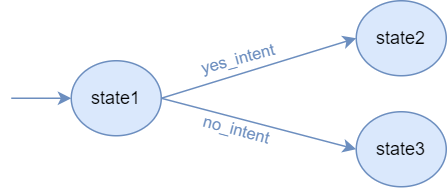

Transitions
===========

Transitions define the connections between agent :doc:`states <states>` and how/when are they triggered.

A transition is a rule that says that the agent must move from a source state to a destination state when some event
occurs.

.. warning::

    Transitions' order matters! The order in which a state's transitions are created is the order in which they will be
    evaluated once the state body finishes its execution.

In this section, we will explain how to create transitions, including the *events* that trigger them, and the various methods available for creating predefined transitions in an easy way.

Let's say we have the following agent:

.. code:: python

    agent = Agent('example_agent')

    state1 = agent.new_state('state1', initial=True)
    state2 = agent.new_state('state2')
    state3 = agent.new_state('state3')
    ...

Intent transitions
------------------

When the user sends a message to the agent, it gets the user intent and uses it to decide which state to move to. When the
user intent matches with a specified transition intent, the agent moves to the specified transition destination state.

Therefore, :any:`intent_matching <besser.agent.library.event.event_library.intent_matched>` is a pre-defined event
integrated into BBF, so you only need to define the transition:

.. code:: python

    state1.when_intent_matched_go_to(yes_intent, state2)
    state1.when_intent_matched_go_to(no_intent, state3)

Visually, this would be the current agent architecture:

You can also define where to go when none of the previous intents is matched:

.. code:: python

    state1.when_no_intent_matched_go_to(state4)

Note **that there is the possibility that the agent cannot transition to any state**. For example, if we do not define the
last transition, when neither yes_intent nor no_intent are matched the agent would not know where to move.
In that scenario, the agent would run the state1's fallback body, without moving to another state
(see :any:`state-fallback-body` for more info).
Thus, it is up to the agent creator to choose whether, in case no intent is matched, a transition to another state takes place or not.

Session variables transitions
-----------------------------

Another kind of event that can make an agent move to another state is
:any:`variable_matches_operation <besser.agent.library.event.event_library.variable_matches_operation>`. This event
compares a value stored in the user session with another one (the target value) applying an operation. If the operation
returns true, the event does as well, and therefore transitioning to the transition's destination.

To create a transition triggered by this kind of event, simply add:

.. code:: python

    import operator # You can import a set of predefined operations from here (or define your own)
    state1.when_variable_matches_operation_go_to('money', operator.lt, 10000, state2)

In the previous example, we defined a transition whose event will return true whenever the variable *money* stored in
the user session is lower than (*lt*) 10000.

One must be cautious when defining these transitions. Following the previous example, when this transition is evaluated,
there must be a 'money' variable in the session (that has to be added in some state body), otherwise this transition
will never be triggered.

File transitions
-----------------------------

It is also possible to cause a transition in case a file is sent by the user with the event called 
:any:`file_received <besser.agent.library.event.event_library.file_received>`. This event
is only triggered if a user sent a file to an agent.

To create a transition triggered by this kind of event, simply add:

.. code:: python

    state1.when_file_received_go_to(state2)

Note that it is also possible to define a list of allowed file types, such that agent creators can impose
restrictions to what can be sent by users to avoid unwanted file types to be processed. 

To add this rule to the transition, simply add:

.. code:: python

    state1.when_file_received_go_to(state2, allowed_types=["application/pdf", "image/png"])

Automatic transitions
---------------------

Another simple but useful kind of transition is the automatic transition. When a state finishes the execution of its
body, if it has an automatic transition the agent will always move to the transition's destination.

This is really useful when, after a sequence of states, we want to automatically return to the starting point of the
conversation.

The implicit event associated with this kind of transition is the
:any:`auto <besser.agent.library.event.event_library.auto>` event, a special event that always returns true.

This is how to create an auto transition:

.. code:: python

    state1.go_to(state2)

.. warning::

    The automatic transition cannot be combined with other transitions in the same state.

.. _custom-event-transitions:

Custom Event transitions
------------------------

This is the generic way to define events that trigger transitions. Until now, the transitions we created had an implicit
event associated to them ('match an intent' or 'a variable meets a condition'). Now we will see how to create custom
events.

An event is a Python function that returns a boolean value (i.e., only ``True`` or ``False`` values), and takes 2
arguments: the user :doc:`session <sessions>` and a dictionary called *event_params*. Let's see an example:

.. code:: python

    import requests # Necessary to make HTTP requests

    def check_temperature(session: Session, event_params: dict):
        api_url = 'http://api.openweathermap.org/data/2.5/weather'
        city = session.get('city')
        appid = event_params.get('weather_appid')
        max_temperature = event_params.get('max_temperature')
        response = requests.get(url=api_url, params=dict(q=city, APPID=appid))
        if response.status_code == 200:
            if response.json()['temperature'] > max_temperature:
                return True
        else:
            print(f"Request failed with status code {response.status_code}")
        return False

This event checks the temperature in a specific city (previously provided by the user and stored in its session). If
it is above some temperature (defined in the event parameters), it will return true, triggering the relevant transition
and moving to another state where the agent could, for instance, warn the user about the high temperature in the city. In
this (fictitious) example, to make a request to the API we need an APPID, provided in the event parameters as well.

Once we have defined the event function, we can attach it to a transition (here, from state1 to state2):

.. code:: python

    state1.when_event_go_to(check_temperature, state2, event_params={'max_temperature': 30, 'appid': YOUR_APP_ID})

The session in an event allows to get user-specific information (that can be set in a state body). The event parameters
allow to have event-specific information (note that this parameters' values could also change during runtime).

API References
--------------

- Agent: :class:`besser.agent.core.agent.Agent`
- Agent.new_state(): :meth:`besser.agent.core.agent.Agent.new_state`
- State: :class:`besser.agent.core.state.State`
- State.go_to(): :meth:`besser.agent.core.state.State.go_to`
- State.when_intent_matched_go_to(): :meth:`besser.agent.core.state.State.when_intent_matched_go_to`
- State.when_event_go_to(): :meth:`besser.agent.core.state.State.when_event_go_to`
- State.when_no_intent_matched_go_to(): :meth:`besser.agent.core.state.State.when_no_intent_matched_go_to`
- State.when_variable_matches_operation_go_to(): :meth:`besser.agent.core.state.State.when_variable_matches_operation_go_to`
- Session: :class:`besser.agent.core.session.Session`
- Session.get(): :meth:`besser.agent.core.session.Session.get`
