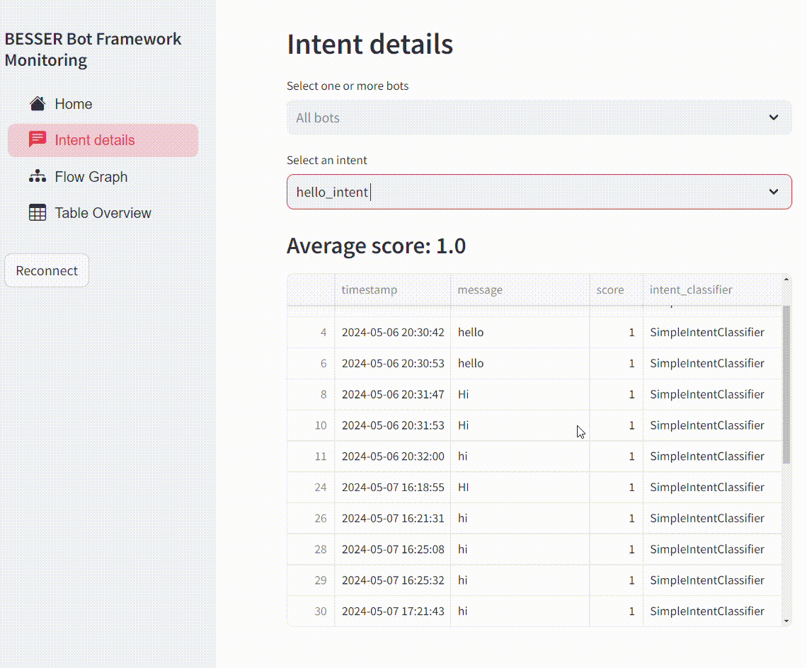
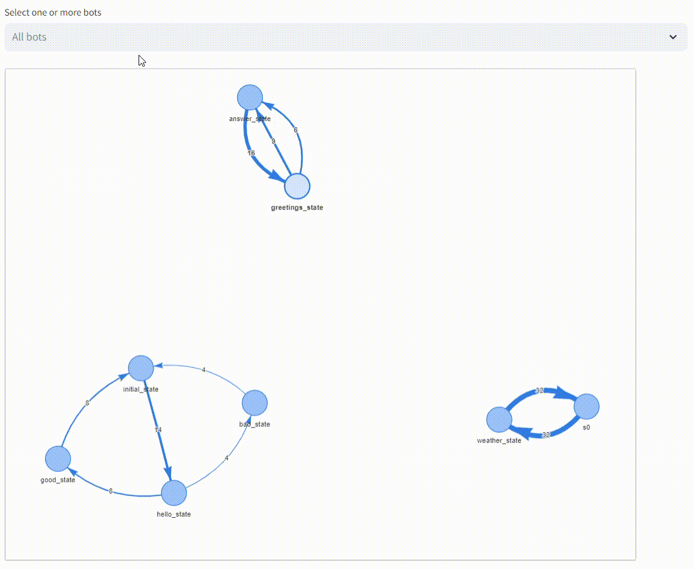
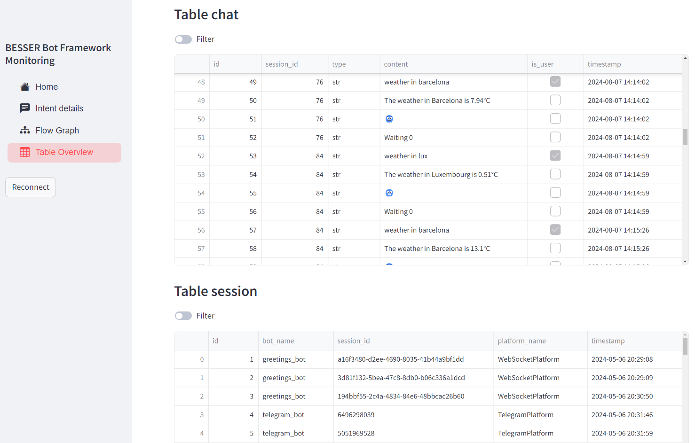

Monitoring UI
=============

We provide a Graphical User Interface  for the :doc:`monitoring_db`, which is aimed at visualizing insights from the agents usage.
It is just an example to illustrate some possible applications of the Monitoring DB. You can also create your own custom
dashboard for the Monitoring DB, or contact us with ideas you would like to include!

The UI is built with `Streamlit <https://streamlit.io/>`_, and included in the BBF library (`source code <https://github.com/BESSER-PEARL/BESSER-Bot-Framework/tree/main/besser/agent/db/monitoring_ui>`_)

It can be run in 2 different ways:

1. If you cloned the BBF repository, open a terminal, navigate to the monitoring_ui directory and run the main script.

Three parameters are mandatory:

- Path to a .ini file containing the :any:`DB credentials <properties-database>`
- Host address where it is to be deployed (e.g., localhost)
- Port where it is to be deployed (e.g., 8401)

.. code:: bash

    cd besser/agent/db/monitoring_ui
    python monitoring_ui.py <config_path> <ui_host> <ui_port>

2. Directly run the Monitoring UI from Python code:

.. code:: python

    from besser.agent.db.monitoring_ui.monitoring_ui import start_ui
    start_ui(config_path, host, port)

Next, we briefly show each page of the Monitoring UI.

Home Page
---------

The Home Page comes with some default visualizations to see all the detected intents, number of messages, matched intents ratio, etc.

Note that it is possible to filter the data used in the visualizations to one (or more) specific agents. This can be done in all the other pages as well.

This page uses all the tables of the Monitoring DB.

.. figure:: ../../img/monitoring_ui_home.gif
   :alt: Monitoring UI Home Page

   Monitoring UI Home Page

Intent Details Page
-------------------

This page asks the user to select a specific intent and then all the messages that matched that intent are displayed in a table.

This is useful to see what messages are matching each intent, but also, when selecting the fallback intent, to see which messages the agent is not
recognizing.

This page uses the table 'intent_prediction' of the Monitoring DB.

   Monitoring UI Intent Details Page

Flow Graph Page
---------------

In this page, flow graphs are displayed to visualize the agent transitions. Each node is an agent state and the edges are transitions between states.

If you hover the mouse you can see the state names and event names (in the transitions).

Note that if you simultaneously visualize multiple agents, if some agents have states with the same name, the graphs will be connected.
To visualize a single agent it is recommended to select it from the filtering cell.

This page uses the table 'transition' of the Monitoring DB.

   Monitoring UI Flow Graph Page

Table Overview Page
-------------------

This page simply shows all the tables from the database.

   Monitoring UI Table Overview Page
