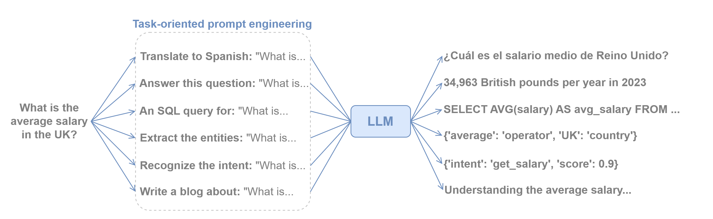

LLM
===

A Large Language Model (LLM) is a type of Artificial Intelligence that is designed to understand and generate human
language. These models are trained on vast amounts of text data and use complex algorithms, particularly deep learning
techniques, to learn the patterns and structures of language.

   Example tasks that can be done with an LLM.

There are multiple kinds of LLMs, so choosing one may become a complicated task if we are not familiar with them.
Moreover, the NLP field moves at a very fast pace, so LLMs become obsolete quite fast (which is actually good because
it means something better has been created out there!).

**Some important things to consider when selecting an LLM:**

- **Proprietary** (e.g., OpenAI) vs **Open-Source** (HuggingFace is the biggest repository): Most proprietary LLMs are good and
  reliable, although it is rare to find good free options.
- **Locally deployed vs through API**: You can use an LLM deployed on your premises, but depending on its size it may be
  cheaper to pay for an API (The HuggingFace Inference API offers some LLMs for free)
- **Latency**: the time the LLM spends to generate the answers.
- **Size**: Smaller LLMs (e.g., 2 billion parameters) tend to be more limited than bigger ones (e.g., 70 billion parameters),
  although they may be enough if you want to deploy locally and for specific tasks.

How to use
----------

Let's see how to seamlessly integrate an LLM into our agent. You can also check the :doc:`../../examples/llm_agent` for a complete example.

We are going to create an LLMOpenAI:

.. code:: python

    from baf.nlp.llm.llm_openai_api import LLMOpenAI

    agent = Agent('example_agent')

    gpt = LLMOpenAI(agent=agent, name='gpt-4o-mini')

This LLM can be used within any agent state (in both the body and the fallback body):

.. code:: python

    def answer_body(session: Session):
        answer = gpt.predict(session.message) # Predicts the output for the given input (the user message)
        session.reply(answer)

There are plenty of possibilities to take advantage of LLMs in an agent. The previous is a very simple use case, but
we can do more advanced tasks through prompt engineering.

.. _llm-context:

Adding context information to an LLM
~~~~~~~~~~~~~~~~~~~~~~~~~~~~~~~~~~~~

To improve / customize the LLM's behavior, it is also possible to add context information to an LLM.
Here, we differentiate between a global context and user-specific context information.
The global context will be applied to every LLM prediction for any user.
The user specific context is only applied for a specific user and can contain user specific information to personalize the LLM's behavior.

Here an example where we extend the previous LLMOpenAI instance:

.. code:: python

    # adding this global_context will cause the LLM to only answer in english.
    gpt = LLMOpenAI(agent=agent, name='gpt-4o-mini', global_context='You only speak english.')

Let's now suppose we have access to the user's name while executing the body of the current state:

.. code:: python

    def answer_body(session: Session):
        user_name = session.message
        # For this specific session, the LLM will always be given the "context" string as additional information.
        gpt.add_user_context(session=session, context=f"The user is called {user_name}", context_name="user_name_context") 
        answer = gpt.predict(session.message) # Predicts the output for the given input (the user message)
        # It's also possible to remove context elements from the user specific context. 
        gpt.remove_user_context(session=session, context_name="user_name_context")
        session.reply(answer)

It is also possible to only add context information for a specific prompt:

.. code:: python

    def answer_body(session: Session):
        user_name = session.message
        answer = gpt.predict(session=session.message, system_message=f'Start your response using the name of the user which is {user_name}')
        session.reply(answer)

Available LLMs
--------------

BAF comes with LLM wrappers that provide the necessary methods to use them. All LLM wrappers must implement the
:class:`~baf.nlp.llm.llm.LLM` class, which comes with the following methods to be implemented:

- :meth:`~baf.nlp.llm.llm.LLM.initialize`: Initialize the LLM.
- :meth:`~baf.nlp.llm.llm.LLM.predict`: Generate the output for a given input.
- :meth:`~baf.nlp.llm.llm.LLM.chat`: Simulate a conversation. The LLM receives previous messages to be able to continue with a conversation. Necessary to get chat history from the :doc:`database <../db/monitoring_db>`. Not mandatory to implement.
- :meth:`~baf.nlp.llm.llm.LLM.intent_classification`: Predict the intent of a given message (it allows the
  :any:`llm-intent-classifier` to use this LLM). Not mandatory to implement.

These are the currently available LLM wrappers in BAF:

**OpenAI-compatible providers** (all inherit from
:class:`~baf.nlp.llm.llm_openai_compatible.LLMOpenAICompatible`; only the ``openai``
SDK is required):

- :class:`~baf.nlp.llm.llm_openai_api.LLMOpenAI`: `OpenAI <https://platform.openai.com/docs/models>`_ (GPT-4o, GPT-4o-mini, …)
- :class:`~baf.nlp.llm.llm_mistral.LLMMistral`: `Mistral AI <https://docs.mistral.ai/>`_ (mistral-small, mistral-large, …)
- :class:`~baf.nlp.llm.llm_deepseek.LLMDeepSeek`: `DeepSeek <https://api-docs.deepseek.com/>`_ (deepseek-chat, deepseek-reasoner)
- :class:`~baf.nlp.llm.llm_google.LLMGoogle`: `Google Gemini <https://ai.google.dev/gemini-api/docs>`_ via the OpenAI-compatible endpoint
- :class:`~baf.nlp.llm.llm_meta.LLMMeta`: `Meta Llama <https://llama.meta.com/>`_ via Meta's hosted API
- :class:`~baf.nlp.llm.llm_qwen.LLMQwen`: `Alibaba Qwen <https://www.alibabacloud.com/help/en/dashscope/>`_ (qwen-max, qwen-plus, …)
- :class:`~baf.nlp.llm.llm_xai.LLMxAI`: `xAI Grok <https://docs.x.ai/>`_ (grok-3, grok-3-mini, …)
- :class:`~baf.nlp.llm.llm_groq.LLMGroq`: `Groq <https://console.groq.com/>`_ (llama-3.3-70b-versatile, mixtral-8x7b-32768, …)
- :class:`~baf.nlp.llm.llm_together.LLMTogether`: `Together AI <https://www.together.ai/>`_ (many open-weight models)
- :class:`~baf.nlp.llm.llm_openrouter.LLMOpenRouter`: `OpenRouter <https://openrouter.ai/>`_ (unified gateway to hundreds of models)

**Native SDK providers:**

- :class:`~baf.nlp.llm.llm_anthropic.LLMAnthropic`: `Anthropic Claude <https://docs.anthropic.com/>`_ (claude-opus-4, claude-sonnet-4, …) — uses the ``anthropic`` SDK
- :class:`~baf.nlp.llm.llm_huggingface.LLMHuggingFace`: `HuggingFace <https://huggingface.co/>`_ models locally deployed
- :class:`~baf.nlp.llm.llm_huggingface_api.LLMHuggingFaceAPI`: HuggingFace models via the `Inference API <https://huggingface.co/docs/api-inference>`_
- :class:`~baf.nlp.llm.llm_replicate_api.LLMReplicate`: `Replicate <https://replicate.com/>`_ models via the Replicate API

.. note::

   Models taken from Huggingface or Replicate might expect a specific prompting or context specification format to improve the results. Be sure to carefully read the guidelines for each model for an optimal experience.

API References
--------------

- Agent: :class:`baf.core.agent.Agent`
- LLM: :class:`baf.nlp.llm.llm.LLM`
- LLM.predict(): :meth:`baf.nlp.llm.llm.LLM.predict`
- LLM.add_user_context(): :meth:`baf.nlp.llm.llm.LLM.add_user_context`
- LLM.remove_user_context(): :meth:`baf.nlp.llm.llm.LLM.remove_user_context`
- LLMOpenAICompatible: :class:`baf.nlp.llm.llm_openai_compatible.LLMOpenAICompatible`
- LLMOpenAI: :class:`baf.nlp.llm.llm_openai_api.LLMOpenAI`
- LLMMistral: :class:`baf.nlp.llm.llm_mistral.LLMMistral`
- LLMDeepSeek: :class:`baf.nlp.llm.llm_deepseek.LLMDeepSeek`
- LLMGoogle: :class:`baf.nlp.llm.llm_google.LLMGoogle`
- LLMMeta: :class:`baf.nlp.llm.llm_meta.LLMMeta`
- LLMAnthropic: :class:`baf.nlp.llm.llm_anthropic.LLMAnthropic`
- LLMQwen: :class:`baf.nlp.llm.llm_qwen.LLMQwen`
- LLMxAI: :class:`baf.nlp.llm.llm_xai.LLMxAI`
- LLMGroq: :class:`baf.nlp.llm.llm_groq.LLMGroq`
- LLMTogether: :class:`baf.nlp.llm.llm_together.LLMTogether`
- LLMOpenRouter: :class:`baf.nlp.llm.llm_openrouter.LLMOpenRouter`
- LLMHuggingFace: :class:`baf.nlp.llm.llm_huggingface.LLMHuggingFace`:
- LLMHuggingFaceAPI: :class:`baf.nlp.llm.llm_huggingface_api.LLMHuggingFaceAPI`:
- LLMReplicate: :class:`baf.nlp.llm.llm_replicate_api.LLMReplicate`:
- Session: :class:`baf.core.session.Session`
- Session.reply(): :meth:`baf.core.session.Session.reply`
