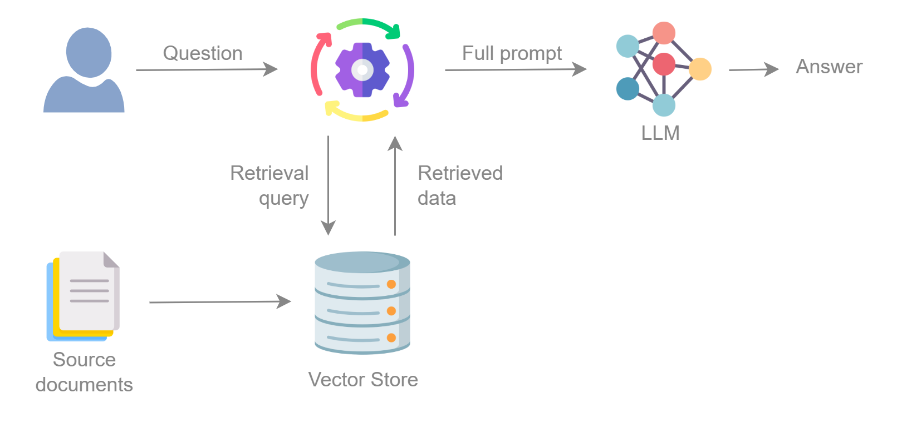

RAG
===

Retrieval-augmented generation (RAG) is a technique for enhancing the accuracy and reliability of generative AI models
with facts fetched from external sources.

The benefits of RAG include:

- **Updated information**: provide LLMs with the latest information (LLMs are trained with data until a certain date)
- **Access to domain-specific information** not seen during training without the need of fine-tuning the LLM.
- **Factual grounding**: reduce hallucinations by providing LLMs with access to a knowledge base

   Pipeline of the RAG process

The key components of RAG are:

- **Embeddings model**: A model trained to generate an embedding for a given input. This embedding is a high-dimensional
  vector that captures the information about the input, such as the semantics. This way, we can determine the similarity
  between 2 inputs by calculating the distance between their embeddings.
- **Vector Store**: It is a specific kind of database for efficient storage, indexing and querying of vector embeddings, or
  numerical representations of unstructured data, such as text, images or audio.
- **Retriever**: Given an input, it gets the most similar chunks from the vector store by comparing the vector embeddings.
- **Generator (LLM)**: It receives the original query and the retrieved data, and generates the answer.

BBF allows you to integrate this process into your agent. Our implementation uses
`LangChain <https://python.langchain.com/>`_, which is a framework for developing apps with LLMs. It comes with a
wide library of resources we can use to customize our RAG's components.

Let's see how to seamlessly integrate a RAG component into our agent.
You can also check the :doc:`../../examples/rag_agent` for a complete example.

First of all, we create our agent:

.. code:: python

    from besser.agent.core.agent import Agent

    agent = Agent('greetings_agent')
    agent.load_properties('config.ini')
    websocket_platform = agent.use_websocket_platform(use_ui=True)

Now, we have to create the RAG components using the LangChain library.

We will need:

Embeddings
----------

An embeddings model. We can use an OpenAI embeddings as an example:

.. code:: python

    from langchain_community.embeddings import OpenAIEmbeddings

    embeddings = OpenAIEmbeddings(openai_api_key='api-key')

.. note::

   - Full list of LangChain `Embeddings <https://api.python.langchain.com/en/latest/community_api_reference.html#module-langchain_community.embeddings>`_ implementations.

Vector Store
------------

A VectorStore. We can use the Chroma vector store as an example:

.. code:: python

    from langchain_community.vectorstores import Chroma

    vector_store: Chroma = Chroma(
        embedding_function=embeddings,
        persist_directory='vector_store'  # directory where we store the vector store, optional
    )

.. note::

   - Full list of LangChain `VectorStore <https://api.python.langchain.com/en/latest/community_api_reference.html#module-langchain_community.vectorstores>`_ implementations.

Text Splitter
-------------

A TextSplitter to divide the documents into smaller chunks (only necessary if we want to load data into the vector store).
LangChain provides different splitters for specific splitting criteria:

.. code:: python

    from langchain_text_splitters import RecursiveCharacterTextSplitter

    splitter = RecursiveCharacterTextSplitter(chunk_size=1000, chunk_overlap=100)

.. note::

   - Full list of LangChain `TextSplitter <https://api.python.langchain.com/en/latest/text_splitters_api_reference.html>`_ implementations.

LLM
---

An LLM, using the BBF :doc:`LLM wrappers <llm>`:

.. code:: python

    from besser.agent.nlp.llm.llm_openai_api import LLMOpenAI

    gpt = LLMOpenAI(agent=agent, name='gpt-4o-mini')

RAG
---

Now we can create the RAG

.. code:: python

    rag = RAG(
        agent=agent,
        vector_store=vector_store,
        splitter=splitter,
        llm_name='gpt-4o-mini',
        k=4,  # Number of chunks to retrieve
        num_previous_messages=0  # Number of previous messages to add to the query
    )

.. note::

    The :doc:`API docs <../../api/nlp/rag>` contain full details on the RAG parameters

Import data
-----------

If you want to load data into the vector store, our implementation with LangChain's PDF loader:

.. code:: python

    rag.load_pdfs('./pdfs')

Or use any of the LangChain's `document loaders <https://api.python.langchain.com/en/latest/community_api_reference.html#module-langchain_community.document_loaders>`_, for instance:

.. code:: python

    from langchain_community.document_loaders import TextLoader

    loader = TextLoader("./index.md")
    documents = loader.load()
    chunked_documents = splitter.split_documents(documents)
    vector_store.add_documents(chunked_documents)

Execution
---------

Finally, let's use the RAG within a state (it can be used in both the body and the fallback body):

.. code:: python

    def rag_body(session: Session):
        # Option 1: it uses the last user message by default
        rag_message: RAGMessage = session.run_rag()
        # Option 2: use a custom message as input
        rag_message: RAGMessage = session.run_rag(message='custom message')
        # Option 3: run RAG without the session
        rag_message: RAGMessage = rag.run(message='custom message')

        # Reply the generated answer
        session.reply(rag_message.answer)
        # Or a specific method to reply RAG messages (to display the answer and the retrieved documents)
        websocket_platform.reply_rag(session, rag_message)

A :class:`~besser.agent.nlp.rag.rag.RAGMessage` is the return object of the RAG. It contains the generated answer together
with the retrieved documents, and additional metadata.

The :doc:`../platforms/websocket_platform` includes a method to reply this kind of messages, and our Streamlit UI can display them within
expander containers that show the retrieved documents to the user.

API References
--------------

- Agent: :class:`besser.agent.core.agent.Agent`
- Agent.load_properties(): :meth:`besser.agent.core.agent.Agent.load_properties`
- Agent.use_websocket_platform(): :meth:`besser.agent.core.agent.Agent.use_websocket_platform`
- LLMOpenAI: :class:`besser.agent.nlp.llm.llm_openai_api.LLMOpenAI`
- RAG: :class:`besser.agent.nlp.rag.rag.RAG`
- RAG.load_pdfs(): :meth:`besser.agent.nlp.rag.rag.RAG.load_pdfs`
- RAG.run(): :meth:`besser.agent.nlp.rag.rag.RAG.run`
- RAGMessage: :class:`besser.agent.nlp.rag.rag.RAGMessage`
- Session: :class:`besser.agent.core.session.Session`
- Session.reply(): :meth:`besser.agent.core.session.Session.reply`
- Session.run_rag(): :meth:`besser.agent.core.session.Session.run_rag`
- WebSocketPlatform.reply_rag(): :meth:`besser.agent.platforms.websocket.websocket_platform.WebSocketPlatform.reply_rag`