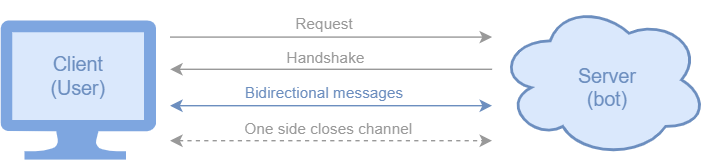

WebSocket platform
==================

The WebSocket Platform allows a bot to communicate with the users using the
`WebSocket <https://en.wikipedia.org/wiki/WebSocket>`_ bidirectional communications protocol.

This platform implements the WebSocket server, and it can establish connection with a client, allowing the
bidirectional communication between server and client (i.e. sending and receiving messages).

The next figure shows how this connection works:

   The bot we just created, has 2 states linked by an intent.

We provide a UI (:doc:`../../api/platforms/streamlit_ui`) implementing a WebSocket client to communicate with the bot,
though you can use or create your own UI as long as it has a WebSocket client that connects to the bot's WebSocket
server. This is how our chatbot UI looks like:

.. figure:: ../../img/websocket_demo.gif
   :alt: WebSocket UI demo

.. note::

    There are some properties the bot needs in order to properly set the WebSocket connection. More details in the
    :any:`configuration properties <properties-websocket_platform>` documentation.

How to use it
-------------

After you instantiate your bot, simply call the following function:

.. code:: python

    bot = Bot('example_bot')
    ...
    websocket_platform = bot.use_websocket_platform(use_ui=True)

If you don't want to use the UI we provide, simply set use_ui to False.

After that, you can use the platform to send different kinds of messages to the user
(from :any:`state bodies<state-body>`):

- Text messages (strings):

.. code:: python

    websocket_platform.reply(session, 'Hello!')

- Pandas `DataFrames <https://pandas.pydata.org/docs/reference/api/pandas.DataFrame.html>`_:

.. code:: python

    websocket_platform.reply_dataframe(session, df)

- List of options (buttons): Display a list of options as buttons and let the user choose one

.. code:: python

    websocket.reply_options(session, ['Yes', 'No'])

- Plotly `figure <https://plotly.com/python-api-reference/generated/plotly.graph_objects.Figure.html>`_:

.. code:: python

    websocket_platform.reply_plotly(session, plot)

⏳ We are working on other replies (files, media, charts...). They will be available soon, stay tuned!

API References
--------------

- Bot: :class:`besser.bot.core.bot.Bot`
- Bot.use_websocket_platform(): :meth:`besser.bot.core.bot.Bot.use_websocket_platform`
- WebSocketPlatform: :class:`besser.bot.platforms.websocket.websocket_platform.WebSocketPlatform`
- WebSocketPlatform.reply(): :meth:`besser.bot.platforms.websocket.websocket_platform.WebSocketPlatform.reply`
- WebSocketPlatform.reply_dataframe(): :meth:`besser.bot.platforms.websocket.websocket_platform.WebSocketPlatform.reply_dataframe`
- WebSocketPlatform.reply_options(): :meth:`besser.bot.platforms.websocket.websocket_platform.WebSocketPlatform.reply_options`
- WebSocketPlatform.reply_plotly(): :meth:`besser.bot.platforms.websocket.websocket_platform.WebSocketPlatform.reply_plotly`
