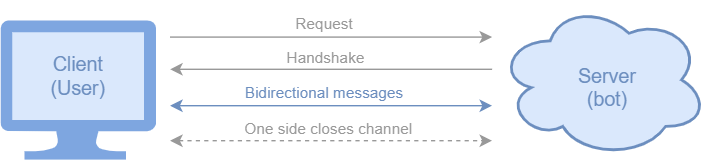

WebSocket platform
==================

The WebSocket Platform allows an agent to communicate with the users using the
`WebSocket <https://en.wikipedia.org/wiki/WebSocket>`_ bidirectional communications protocol.

This platform implements the WebSocket server, and it can establish connection with a client, allowing the
bidirectional communication between server and client (i.e. sending and receiving messages).

The next figure shows how this connection works:

   Figure illustrating the WebSocket protocol.

User Interface

BAF comes with some User Interfaces (WebSocket clients) to use the WebSocket platform.

Of course, you are free to use or create your own UI as long as it has a WebSocket client that connects to the agent's WebSocket server.

.. toctree::
   :maxdepth: 1

   websocket_platform/streamlit_ui
   websocket_platform/chat_widget

(Their source code can be found in the baf.platforms.websocket package)

.. note::

    There are some properties the agent needs in order to properly set the WebSocket connection. More details in the
    :any:`configuration properties <properties-websocket_platform>` documentation.

Restricting allowed origins
---------------------------

By default, the WebSocket server accepts connections from any origin. You can restrict which origins are
allowed to connect by setting the ``origins`` property in your ``config.yaml``:

.. code:: yaml

    platforms:
      websocket:
        host: localhost
        port: 8765
        origins:
          - "https://editor.besser-pearl.org"
          - "https://localhost:8000"

When ``origins`` is set, the server will reject WebSocket upgrade requests from any origin not in the list.
When not set (default), all origins are accepted.

How to use it
-------------

After you instantiate your agent, simply call the following function:

.. code:: python

    agent = Agent('example_agent')
    ...
    websocket_platform = agent.use_websocket_platform(use_ui=True)

If you don't want to use the UI we provide, simply set use_ui to False.

After that, you can use the platform to send different kinds of messages to the user
(from :any:`state bodies<state-body>`):

- Text messages (strings):

.. code:: python

    websocket_platform.reply(session, 'Hello!')

- Text messages in `Markdown <https://www.markdownguide.org/>`_ format:

.. code:: python

    websocket_platform.reply_markdown(session, """
        # Welcome to the agent experience
        ## Section 1
        - one
        - two
    """)

- Text messages in `HTML <https://en.wikipedia.org/wiki/HTML>`_ format:

.. code:: python

    websocket_platform.reply_html(session, """
        <h1>Title</h1>
        <ul>
            <li>Apples</li>
            <li>Bananas</li>
            <li>Cherries</li>
        </ul>
    """)

- Pandas `DataFrames <https://pandas.pydata.org/docs/reference/api/pandas.DataFrame.html>`_:

.. code:: python

    websocket_platform.reply_dataframe(session, df)

- List of options (buttons): Display a list of options as buttons and let the user choose one

.. code:: python

    websocket.reply_options(session, ['Yes', 'No'])

- Plotly `figure <https://plotly.com/python-api-reference/generated/plotly.graph_objects.Figure.html>`_:

.. code:: python

    websocket_platform.reply_plotly(session, plot)

- Files:

.. code:: python

    file = File(file_name="name", file_type="type", file_base64="file_base64")
    websocket_platform.reply_file(session, file)

- Locations:

.. code:: python

    latitude, longitude = 49.50177449302207, 5.94862573528648
    websocket_platform.reply_location(session, latitude, longitude)

- :doc:`../nlp/rag` Messages:

.. code:: python

    rag_message: RAGMessage = session.run_rag()
    websocket_platform.reply_rag(session, rag_message)

⏳ We are working on other replies (files, media, charts...). They will be available soon, stay tuned!

The WebSocket platform allows the following kinds of user messages:

- Text messages
- Voice messages
- Files

.. _websocket-persist-sessions:

Enabling persistent user sessions
---------------------------------
When building your own UI on top of the WebSocket API, implement user authentication so every connection can be tied to a stable identifier. BAF maps connections to sessions using either the ``X-User-ID`` header or the ``user_id`` query parameter from the handshake URL. If both are provided, the header takes precedence. If neither identifier is available, the platform treats the connection as a new anonymous user.

Once your client authenticates users, include the identifier in the WebSocket handshake headers:

.. code:: python

    ws = websocket.WebSocketApp(
        f"ws://{host}:{port}/",
        header={"X-User-ID": user_id},
        on_open=on_open,
        on_message=on_message,
        on_error=on_error,
        on_close=on_close,
        on_ping=on_ping,
        on_pong=on_pong,
    )

If you cannot control the HTTP headers, you can also attach the identifier as a query parameter on the WebSocket URL:

.. code:: python

    ws = websocket.WebSocketApp(
        f"ws://{host}:{port}/?user_id={user_id}",
        on_open=on_open,
        on_message=on_message,
        on_error=on_error,
        on_close=on_close,
        on_ping=on_ping,
        on_pong=on_pong,
    )

On the agent's side, you'll need to start the monitoring database and set the ``persist_sessions=True`` parameter when initializing the agent:

.. code:: python

    agent = Agent('example_agent', persist_sessions=True)

Requesting the chat history for a session
-----------------------------------------

If your UI client wants to request the chat history for a given session (for example, when a user reconnects after a disconnection), it can do so by sending a message with the action ``FETCH_USER_MESSAGES`` and the corresponding ``user_id`` in the payload:

.. code:: python

    payload = Payload(
        action=PayloadAction.FETCH_USER_MESSAGES,
        message=None,
        user_id=username,
    )

The websocket platform will start by sending the previous messages to the client with a flag "history" set to True, so the client can differentiate between historical messages and new incoming messages.

Communication between agents: Multi-agent systems
-------------------------------------------------

An agent can communicate, not only with human users, but with other agents as well. When we design such agents they
become a **multi-agent system**.

A multi-agent or agentic system is an approach to solve complex problems by defining multiple agents to tackle specific tasks. These
tasks divide the main problem into smaller and easier to handle problems. With these systems, we get:

- **Easier agentic design**: divide your problem into small tasks and create a simpler agent for each of them.
- **Modular design**: each agent acts as an independent actor and can be part of many agentic systems, being called from and when necessary.

The communication between agents is done thanks to the WebSocketPlatform. An agent `A` can send a message to another
agent `B` by simply connecting to agent `B`'s WebSocket platform:

.. code:: python

    # Agent A
    def get_weather_body(session: Session):
        # Send message to Agent B, providing its WebSocketPlatform address and the message
        session.send_message_to_websocket('ws://localhost:6000', session.message)

Agent `B` will receive the message and will treat it the same way as if it was a human message. It will create a new
session for agent `A`, detect the intent, transition to another state, etc.

.. code:: python

    # Agent B, let's assume this state is run when it receives agent A's message
    def generate_weather_body(session: Session):
        # Some code to get the weather from the message agent A sent
        temperature = api.get_weather(session.message)
        # Send the temperature to the session's user (i.e., agent A)
        session.reply(temperature)

After that, agent `A` will receive agent `B`'s message (the temperature), which will trigger intent classification,
transition to another state, etc.

.. code:: python

    # Agent A's next state
    def show_weather_body(session: Session):
        # Just print what Agent B sent, i.e., the temperature
        session.reply(session.message)

API References
--------------

- Agent: :class:`baf.core.agent.Agent`
- Agent.use_websocket_platform(): :meth:`baf.core.agent.Agent.use_websocket_platform`
- Session: :class:`baf.core.session.Session`
- Session.reply(): :meth:`baf.core.session.Session.reply`
- Session.send_message_to_websocket(): :meth:`baf.core.session.Session.send_message_to_websocket`
- WebSocketPlatform: :class:`baf.platforms.websocket.websocket_platform.WebSocketPlatform`
- WebSocketPlatform.reply(): :meth:`baf.platforms.websocket.websocket_platform.WebSocketPlatform.reply`
- WebSocketPlatform.reply_dataframe(): :meth:`baf.platforms.websocket.websocket_platform.WebSocketPlatform.reply_dataframe`
- WebSocketPlatform.reply_file(): :meth:`baf.platforms.websocket.websocket_platform.WebSocketPlatform.reply_file`
- WebSocketPlatform.reply_location(): :meth:`baf.platforms.websocket.websocket_platform.WebSocketPlatform.reply_location`
- WebSocketPlatform.reply_options(): :meth:`baf.platforms.websocket.websocket_platform.WebSocketPlatform.reply_options`
- WebSocketPlatform.reply_plotly(): :meth:`baf.platforms.websocket.websocket_platform.WebSocketPlatform.reply_plotly`
- WebSocketPlatform.reply_rag(): :meth:`baf.platforms.websocket.websocket_platform.WebSocketPlatform.reply_rag`
